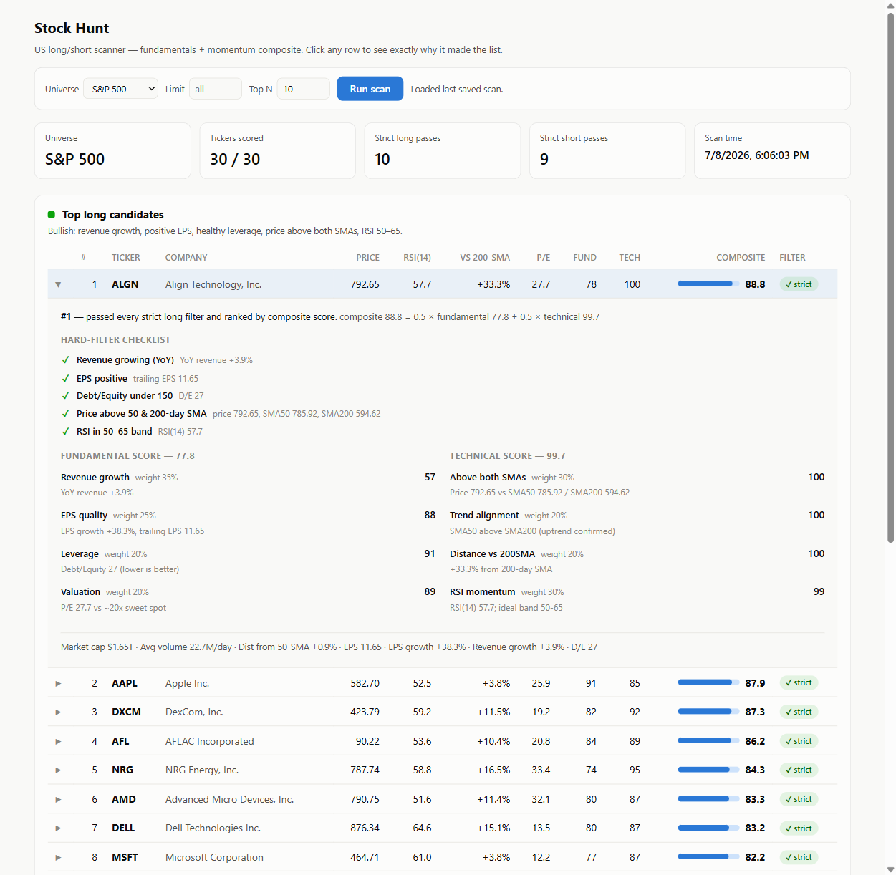

# Stock Hunt — US Long/Short Stock Scanner

Scans a liquid universe of US stocks (S&P 500 or Nasdaq-100) and ranks the
**Top 10 long candidates** (strong fundamentals + bullish momentum) and
**Top 10 short candidates** (weak fundamentals + breakdown momentum), with a
full per-stock explanation of *why* each name made the list.

Comes in two flavors that share the same engine:

- **CLI** — `stock_scanner.py` prints ranked tables to the terminal.
- **Web dashboard** — `app.py` serves an interactive GUI where every row
  expands into a drill-down: the hard-filter checklist, weighted score
  components, and the raw metrics behind them.

Data source: Yahoo Finance via [`yfinance`](https://github.com/ranaroussi/yfinance)
(free, no API key required).



---

## Quick start

```bash
# 1. Create and activate a virtual environment
python -m venv .venv
.venv\Scripts\activate          # Windows
# source .venv/bin/activate     # macOS / Linux

# 2. Install dependencies
pip install -r requirements.txt

# 3a. Run the web dashboard (recommended)
python app.py                   # open http://127.0.0.1:5000

# 3b. Or run the CLI
python stock_scanner.py
```

### CLI options

```bash
python stock_scanner.py                            # full S&P 500 scan
python stock_scanner.py --universe nasdaq100       # Nasdaq-100 universe
python stock_scanner.py --tickers AAPL,MSFT,TSLA   # custom ticker list
python stock_scanner.py --sector "Technology"      # filter by business activity
python stock_scanner.py --top-n 15                 # more/fewer results per side
python stock_scanner.py --limit 50                 # cap universe (quick tests)
```

A full 500-ticker scan takes several minutes: prices download in throttled
batches and fundamentals are fetched per-ticker through a global rate limiter
(see [Rate limiting](#rate-limiting)).

---

## How stocks are selected

### 1. Liquidity gate (both sides)

Names must have **market cap > $2B** and **average daily volume > 1M shares**
(trailing 3 months). Everything else is discarded before scoring.

### 2. Hard filters — the strict checklist

| | Long | Short |
|---|---|---|
| Revenue | growing YoY | at least **one** weakness: declining revenue, |
| EPS | positive (trailing) | negative EPS, P/E > 40, or D/E > 200 |
| Leverage | debt/equity < 150 | *(any one of the above suffices)* |
| Trend | price **above** 50- & 200-day SMA | price **below** 50- & 200-day SMA |
| Momentum | RSI(14) in **50–65** | RSI(14) in **35–50** |

The RSI bands deliberately exclude extremes: longs that are strong but not
severely overbought, shorts that are weak but not severely oversold.

### 3. Composite score — the ranking

Every stock also gets a 0–100 composite: `0.5 × fundamental + 0.5 × technical`.

**Fundamental** (long side shown; short side is the mirror):

| Component | Weight | Rewards |
|---|---|---|
| Revenue growth | 35% | higher YoY growth |
| EPS quality | 25% | growing EPS; unprofitable names penalized 70% |
| Leverage | 20% | lower debt/equity |
| Valuation | 20% | P/E near a ~20x sweet spot |

**Technical:**

| Component | Weight | Rewards |
|---|---|---|
| Above/below both SMAs | 30% | trend agreement with the thesis |
| Trend alignment | 20% | SMA50 vs SMA200 confirming the direction |
| Distance vs 200-SMA | 20% | strength of the move |
| RSI momentum | 30% | proximity to the ideal RSI band center |

### 4. Ranking: strict first, then backfill

Stocks passing **every** hard filter rank first, ordered by composite score.
If fewer than N pass, the list is topped up ("backfill") with the next-best
names by composite — each clearly labeled in the `Filter` column and, in the
dashboard drill-down, annotated with exactly which check failed and why.

---

## The web dashboard

```bash
python app.py    # http://127.0.0.1:5000
```

- **Run scan** against S&P 500 or Nasdaq-100, with optional universe limit
  and Top N; progress streams live into the header.
- **Sector filter** — re-ranks both tables by principal business activity
  (GICS sector) instantly from the cached scan; no new API calls.
- **Drill-down** — click any row to see:
  - a verdict line: strict pass, or which rule a backfill failed;
  - the hard-filter checklist with ✓/✗ and actual values per check;
  - fundamental & technical score components with weights and meter bars;
  - raw metrics: sector/industry, market cap, volume, EPS, growth, D/E.
- Results persist to `last_scan.json`, so the last scan is shown after a
  server restart. Light and dark themes follow the OS preference.

### API

| Endpoint | Description |
|---|---|
| `POST /api/scan` | start a scan; JSON body: `universe`, `limit`, `top_n`, `tickers` |
| `GET /api/status` | scan state: `idle` / `running` / `done` / `error` + progress message |
| `GET /api/results?sector=X&top_n=N` | latest results, optionally re-ranked per sector |

---

## Rate limiting

Yahoo Finance aggressively throttles bursts of requests. The scanner is built
to survive this, but the limits are per-IP and real:

- Price history downloads go in **batches of 40 tickers** with pauses between
  batches; missing tickers are retried in later rounds with exponential backoff.
- Fundamentals requests pass through a **global rate limiter** shared across
  all worker threads (min interval between any two requests), with long
  backoff on HTTP 429 responses.

If a scan still ends with many `Too Many Requests` warnings, the IP has been
temporarily throttled — wait 15–30 minutes and avoid running two scans in
parallel. The sector filter never refetches, so use it freely.

## Project layout

```
stock_hunt/
├── stock_scanner.py    # engine + CLI: fetching, indicators, scoring, ranking
├── app.py              # Flask server wrapping the engine for the dashboard
├── templates/
│   └── index.html      # self-contained dashboard (no CDN dependencies)
├── requirements.txt
└── last_scan.json      # cache of the most recent scan (auto-generated)
```

## Disclaimer

This is a screening tool, not investment advice. Scores and filters are
mechanical heuristics over Yahoo Finance data, which can be delayed, missing,
or wrong. Shorting in particular carries unlimited downside — do your own
research before acting on any output.
